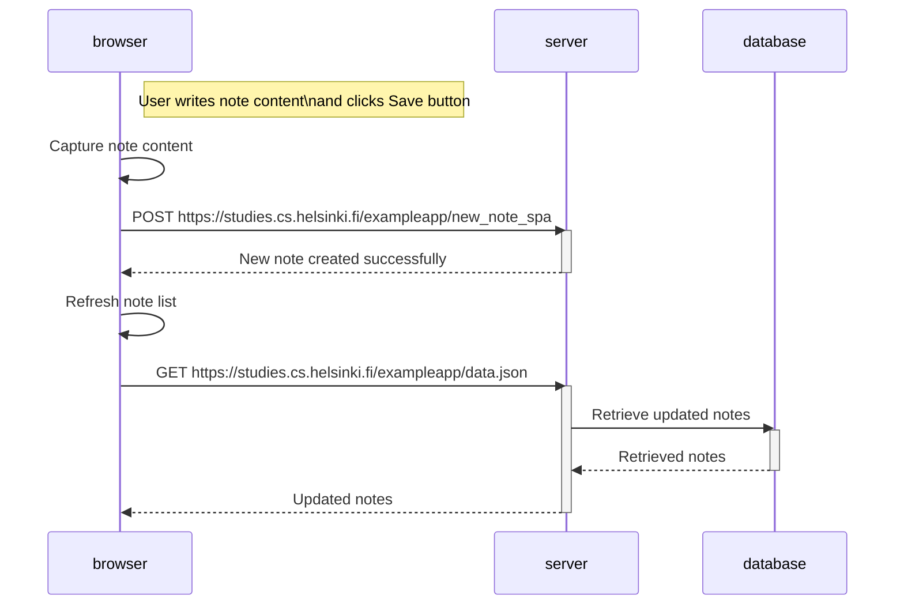

```mermaid
sequenceDiagram
    participant browser
    participant server
    participant database

    Note right of browser: User writes note content\nand clicks Save button

    browser->>browser: Capture note content
    browser->>server: POST https://studies.cs.helsinki.fi/exampleapp/new_note_spa
    activate server
    server-->>browser: New note created successfully
    deactivate server

    browser->>browser: Refresh note list
    browser->>server: GET https://studies.cs.helsinki.fi/exampleapp/data.json
    activate server
    server->>database: Retrieve updated notes
    activate database
    database-->>server: Retrieved notes
    deactivate database
    server-->>browser: Updated notes
    deactivate server
```
